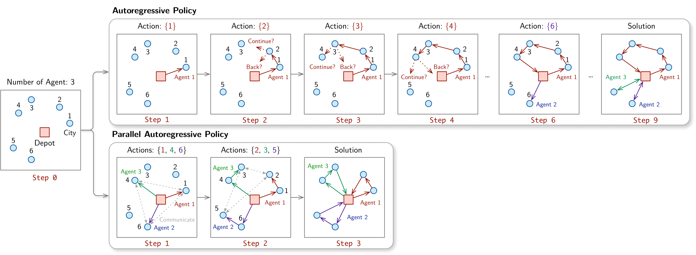
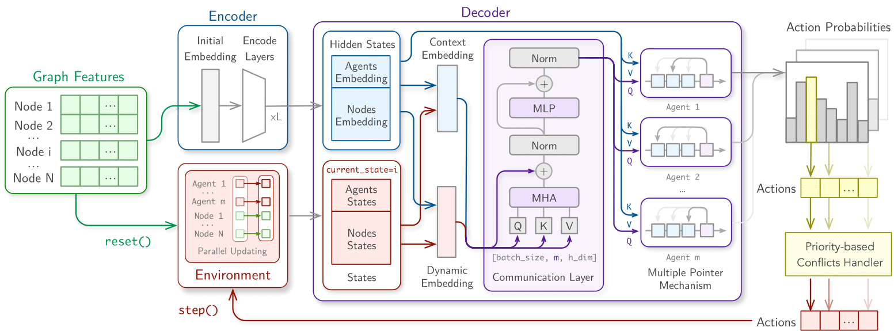

# PARCO

[](https://arxiv.org/abs/2409.03811) [](https://join.slack.com/t/rl4co/shared_invite/zt-1ytz2c1v4-0IkQ8NQH4TRXIX8PrRmDhQ)
[](https://opensource.org/licenses/MIT)

Code repository for "PARCO: Learning Parallel Autoregressive Policies for Efficient Multi-Agent Combinatorial Optimization"


<div align="center">
    
    <i> Autoregressive policy (AR) and Parallel Autoregressive (PAR) decoding </i>
</div>

<br>

<div align="center">
    
    <i> PARCO Model</i>
</div>


## 🚀 Usage

### Installation

```bash
pip install -e .
```

Note: we recommend using a virtual environment. Using Conda:

```bash
conda create -n parco
conda activate parco
```

### Data generation
You can generate data using the `generate_data.py`, which will automatically generate all the data we use for training and testing:

```bash
python generate_data.py
```

### Quickstart Notebooks
We made examples for each problem that can be trained under two minutes on consumer hardware. You can find them in the `examples/` folder:

- [1.quickstart-hcvrp.ipynb](examples/1.quickstart-hcvrp.ipynb): HCVRP (Heterogeneous Capacitated Vehicle Routing Problem)
- [2.quickstart-omdcpdp.ipynb](examples/2.quickstart-omdcpdp.ipynb): OMDCPDP (Open Multi-Depot Capacitated Pickup and Delivery Problem)
- [3.quickstart-ffsp.ipynb](examples/3.quickstart-ffsp.ipynb): FFSP (Flexible Flow Shop Scheduling Problem)


### Train your own model
You can train your own model using the `train.py` script. For example, to train a model for the HCVRP problem, you can run:

```bash
python train.py experiment=hcvrp
```

you can change the `experiment` parameter to `omdcpdp` or `ffsp` to train the model for the OMDCPDP or FFSP problem, respectively.


Note on legacy FFSP code: the initial version we made was not yet integrated in RL4CO, so we left it the [`parco/tasks/ffsp_old`](parco/tasks/ffsp_old/README.md) folder, so you can still use it.


### Testing

You may run the `test.py` script to evaluate the model, e.g. with greedy decoding:

```bash
python test.py --problem hcvrp --decode_type greedy --batch_size 128
```

(note: we measure time with single instance -- batch size 1, but larger makes the overall evaluation faster), or with sampling:

```bash
python test.py --problem hcvrp --decode_type sampling --batch_size 1 --sample_size 1280
```


## 🤩 Citation

If you find PARCO valuable for your research or applied projects:

```bibtex
@article{berto2024parco,
    title={{PARCO: Learning Parallel Autoregressive Policies for Efficient Multi-Agent Combinatorial Optimization}},
    author={Federico Berto and Chuanbo Hua and Laurin Luttmann and Jiwoo Son and Junyoung Park and Kyuree Ahn and Changhyun Kwon and Lin Xie and Jinkyoo Park},
    year={2024},
    journal={arXiv preprint arXiv:2409.03811},
    note={\url{https://github.com/ai4co/parco}}
}
```

We will also be happy if you cite the RL4CO framework that we used to create PARCO:

```bibtex
@article{berto2024rl4co,
    title={{RL4CO: an Extensive Reinforcement Learning for Combinatorial Optimization Benchmark}},
    author={Federico Berto and Chuanbo Hua and Junyoung Park and Laurin Luttmann and Yining Ma and Fanchen Bu and Jiarui Wang and Haoran Ye and Minsu Kim and Sanghyeok Choi and Nayeli Gast Zepeda and Andr\'e Hottung and Jianan Zhou and Jieyi Bi and Yu Hu and Fei Liu and Hyeonah Kim and Jiwoo Son and Haeyeon Kim and Davide Angioni and Wouter Kool and Zhiguang Cao and Jie Zhang and Kijung Shin and Cathy Wu and Sungsoo Ahn and Guojie Song and Changhyun Kwon and Lin Xie and Jinkyoo Park},
    year={2024},
    journal={arXiv preprint arXiv:2306.17100},
    note={\url{https://github.com/ai4co/rl4co}}
}
```

---

<div align="center">
    <a href="https://github.com/ai4co">
        
    </a>
</div>